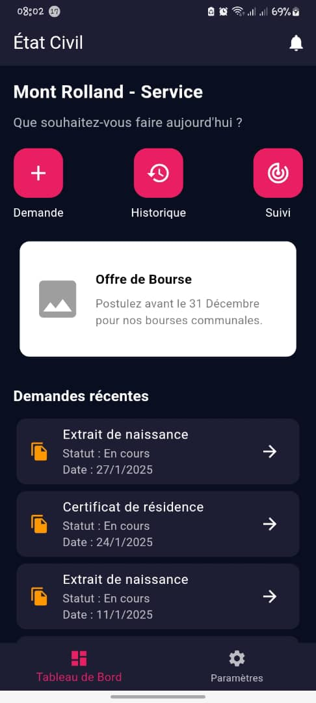
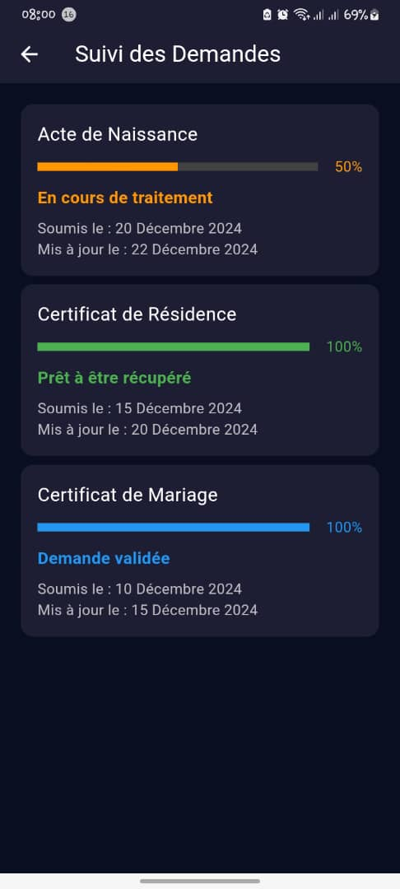
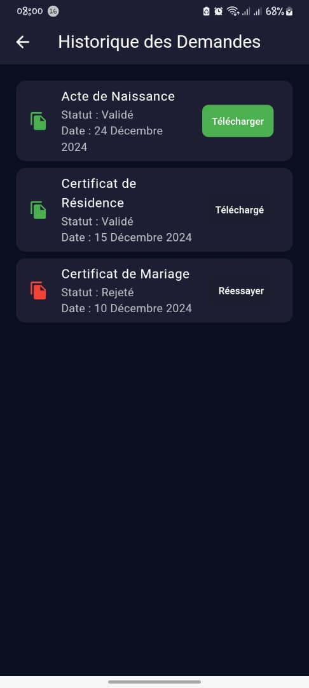
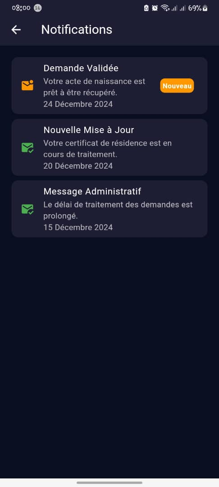

# E-civil

E-civil est une application mobile développée pour la commune de Mont Rolland, facilitant l'accès aux services administratifs pour les citoyens. Cette application est construite avec Flutter et utilise Firebase pour la gestion des données.

## Fonctionnalités

- **Demande de documents officiels** : Extraire de naissance, certificat de résidence, et autres documents administratifs.
- **Suivi des demandes** : Notifications en temps réel sur l'avancement des demandes.
- **Informations utiles** : Horaires d'ouverture des bureaux, coordonnées des services administratifs, et procédures à suivre.
- **Gain de temps** : Démarches administratives simplifiées et accessibles depuis un smartphone.

## Technologies utilisées

- **Flutter** : Framework open-source pour le développement d'applications mobiles.
- **Firebase** : Plateforme de développement d'applications mobiles et web, utilisée pour l'authentification, la base de données en temps réel, et les notifications push.

## Captures d'écran

  

*Écran de connexion*  

  

*Écran d'inscription*  

  

*Écran d'accueil de l'application E-civil*  

  

*Interface pour faire une demande de document officiel*  

  

*Suivi des demandes en temps réel*  

  

*Historique des demandes*  

  

*Gestion des notifications*  

  

*Écran de réinitialisation du mot de passe*  

## 🎥 Démo de l'application

